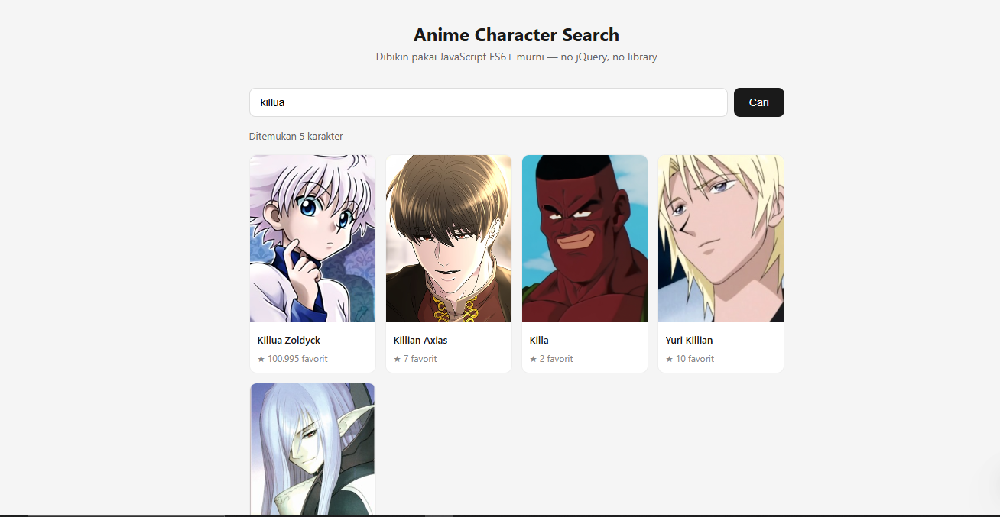

# Anime Character Search 🎌

Aplikasi web sederhana untuk mencari karakter anime menggunakan [Jikan API](https://jikan.moe/) — dibangun **tanpa framework, tanpa library**, murni JavaScript ES6+.



---

## ✨ Fitur

- Cari karakter anime berdasarkan nama
- Tampilkan foto, nama, dan jumlah favorit tiap karakter
- Pencarian bisa dipicu tombol **Cari** atau tekan **Enter**
- Error handling — API gagal tetap ditangani dengan pesan yang jelas

---

## 🧠 Konsep ES6+ yang Dipelajari

| Konsep | Dipakai di mana |
|---|---|
| **Arrow function** | `.map()`, event listener |
| **Async / Await** | Fetch data dari Jikan API |
| **Destructuring** | Ambil `name`, `images`, `favorites` dari response API |
| **Template literal** | Render kartu HTML secara dinamis |
| **ES Modules** | `import` / `export` antar file `main.js` ↔ `utils.js` |
| **Optional chaining `?.`** | Akses `images?.jpg?.image_url` tanpa error kalau null |
| **Nullish coalescing `??`** | Fallback foto kalau data kosong |

---

## 📁 Struktur File

```
anime-character-search/
├── index.html   # Struktur halaman
├── style.css    # Tampilan
├── main.js      # Logic utama — event listener, handle search
└── utils.js     # Helper — fetch API, render kartu HTML
```

---

## 🚀 Cara Menjalankan

Karena menggunakan ES Modules (`type="module"`), file harus dijalankan lewat local server — tidak bisa dibuka langsung dengan double-click.

**Opsi 1 — Node.js:**
```bash
npx serve .
```

**Opsi 2 — VS Code:**
Install extension [Live Server](https://marketplace.visualstudio.com/items?itemName=ritwickdey.LiveServer), klik kanan `index.html` → **Open with Live Server**

---

## 🔍 Yang Gua Pelajari

- Cara kerja `fetch` + `async/await` untuk ambil data dari API eksternal
- Kenapa harus `console.log(data)` dulu sebelum destructuring — struktur response API tidak selalu sesuai asumsi
- Perbedaan `?.` (optional chaining) vs cara lama `data && data.images && data.images.jpg`
- Kenapa `type="module"` diperlukan untuk pakai `import/export` di browser

---

## 📡 API

Menggunakan [Jikan API v4](https://docs.api.jikan.moe/) — REST API publik untuk data MyAnimeList. Gratis, tanpa API key.

Endpoint yang dipakai:
```
GET https://api.jikan.moe/v4/characters?q={query}&limit=12
```

---

*Project ini bagian dari seri belajar malam — satu topik, satu project, setiap malam.*
